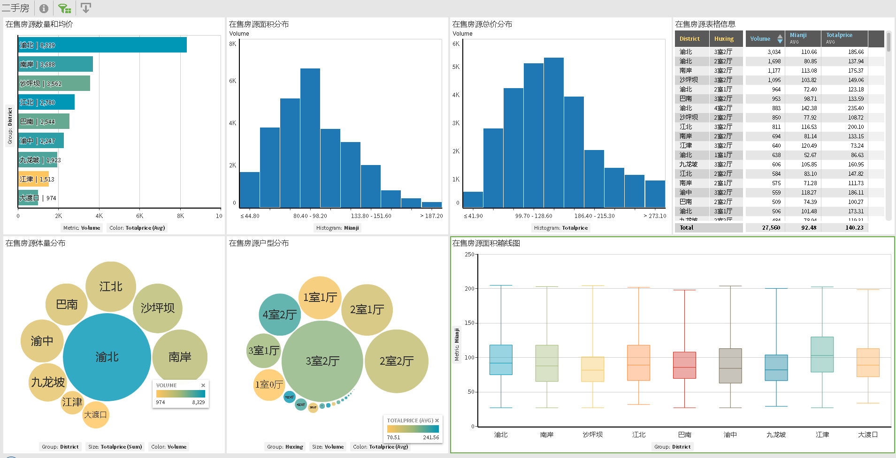

```{r setup, include=FALSE}
knitr::opts_chunk$set(echo = TRUE,eval=FALSE)
```

-----------------------------------------------------------------------

###背景说明
小王在重庆工作十年，打算要二胎，想要买个大点的房子，不想太折腾，希望了解一下重庆的二手房信息。包括重庆二手房供应量，价格区间以及价格走势。 
小王一家现住渝中，夫妻上班都在江北或渝北。**房子首选北区，面积在110-150平，总价在150-200万**，三房或四房均可。交通，商业都方便点的，最好有好的学校，装修差或者老房子的话预算要减少10万，会自己重装。

-----------------------------------------------------------------------

###1 获取数据
爬虫从链家抓数据,代码参考 [lianjia-spider](https://github.com/jumper2014/lianjia-spider)  
根据提示准备好python 3* 环境，运行命令爬取数据保存为csv格式。 这里爬取重庆主城9区（江津换北碚?）20180910的数据。

* 小区房价数据存储目录为 data/xiaoqu/city/date
* 二手房房价数据存储目录为 data/ershou/city/date
* 出租房房价数据存储目录为 data/zufang/city/date
* 新房房价数据存储目录为 data/loupan/city/date

-----------------------------------------------------------------------

##2 数据处理和加载
需要将csv数据加载进数据库，这里我选**postgres**, 比mysql要好用得多。  
各类数据库都有相应的utility/命令/工具快速加载csv平文件，比如pgfutter之于Postgres, sqlldr之于Oracle, copy之于Vertica，google一下就知道更多了。  
我这里使用R读取文件夹下的csv然后加载进数据库。此方法效率并不高，但数据量小无所谓。  
核心R代码：

```{r, eval=FALSE,echo=TRUE, tidy=TRUE}
library(RJDBC)
	xiaoqufiles = list.files(xiaoqupath)
	n=length(xiaoqufiles)
	df=data.frame()
	for (i in 1:n) {
        new.data = read.csv(xiaoqufiles[i],header=FALSE, sep = ",",stringsAsFactors=FALSE,fileEncoding = "GBK" )
        df = rbind(df,new.data)
      }
  dbWriteTable(pconn, value = df, name = "ershou", overwrite=TRUE ) 
 
```

 
以上方法的前提是csv是标准的结构化数据。但网页抓取来的数据，可能不规范，比如在ershou数据中，有描述字段内容包含逗号。比如  *“同心家园正规3房,住家安静,视野开阔”* 本应该是一个字段，但在读取csv时会把它视为三个字段，这样加载进数据库时就会出错。解决办法可以是：  

1. 抓取数据时分隔符不用逗号，而用正常数据中不会出现的特殊的字符，比如ASCII中不可见字符，或可见字符中 ^, 或者^^这样的。
2. 抓取数据时除了分隔符，还要用包围符号(enclosed by)，常见的当然是双引号。
3. 加载进数据库前用正则表达式匹配出含分隔符的字段，保证数据是结构化的再加载进去。
4. 直接将整行数据当作一个字段加载进数据库，后续再用sql或者procedure编辑方式处理分隔各个字段。  
比如以下数据在postgres 里提取各个字段，用到split_part(), substring(), strpos()等方法。  

*"20180910,渝中,大坪,楼层和视野好，通透、明亮, 此房满两年，采光充足,94万,宝香居  | 2室2厅 | 66平米 | 东南 | 简装 | 有电梯"*

```{r,eval=TRUE,echo=FALSE,message=FALSE}
library(RJDBC)
	pDriver <- JDBC(driverClass="org.postgresql.Driver", classPath="D:/Program Green/Squirrel3.0/lib/postgresql-9.4.1211.jre6.jar")
	pconn <- dbConnect(pDriver, "jdbc:postgresql://zdvm24:5432/lianjia?autosave=always", "postgres", "postgres")

vsql="select district,area,description,totalprice,estatetype,xiaoqu,huxing,mianji,chaoxiang,zhuangxiu,shuoming from ershou_trans where description2 = '宝香居  | 2室2厅 | 66平米 | 东南 | 简装 | 有电梯'"
df<-dbGetQuery(pconn,vsql)
knitr::kable(df,format = "markdown",padding=0)
```

-----------------------------------------------------------------------

###3 探索性分析  

####数据库查询
数据加载进数据库，就可以愉快的写sql查看一些指标和数据分布了。比如  

**查看单价最高的小区[非别墅]**  
```{r,eval=TRUE,echo=TRUE}
vsql=" select district,area,xiaoqu,round(avg(danjia)) danjia,count(8) cnt from (
 select district,area,xiaoqu,huxing,mianji,totalprice,round(totalprice*10000/mianji) danjia, chaoxiang,zhuangxiu from ershou_trans where estatetype not like '%别墅%') c group by 1,2,3 order by 4 desc"
df<-dbGetQuery(pconn,vsql)
knitr::kable(head(df),format = "markdown",padding=0)

```

####可视化图表
除了查看表格数据，可视化的数据探索也不可少。   
这里使用我这已有的大数据可视化工具[zoomdata](https://www.zoomdata.com/),连接上数据库中的ershou_trans（在售二手房数据） [点击查看](http://t.cn/RsFj3aX)

  

* 渝北的二手房数量(8000+)和房屋体量（总价）远高于其它地区。这跟渝北地多，经济向北发展有关系。  
* 江津的二手房面积最大也最便宜，毕竟离主城远啊；沙坪坝的二手房小户型居多，估计相当一部分是学区房，只求有个入学名额，面积大小无所谓。  
* 户型上看3室2厅是供应量最多的，但单价最贵的却是4室2厅大户型。改善性住房需求突出，供需关系决定了价格。  
* 面积（应该是建筑面积)上看80-100平的最多，总价在110-150万的占较多。  


  

照母山现在新房不多了，但二手房火热，延续着前两年新房火热的态势，量价齐飞（去年把照母山的房子卖了的，悔不悔）。  
但如果只看精装修的，汽博中心和龙头寺的更多，因为相比而言更成熟。  
只看毛坯房的话，空港新城的最多，明显偏了点，投资客都不愿意花那装修钱。很想知道这些区域的真实成交量怎样，对比着看会有意思。  
80-90平的3室2厅是主流，房屋总价在130-160万的居多  

-----------------------------------------------------------------------

###5 主题分析  
结合租房数据分析**租售比** （租售比=年租金/房价，反映房屋通过租金方式的回报率。房产的回报还可能是价值上涨）  

> 从数据来看，美国的达拉斯、洛杉矶、纽约，日本的大阪、东京都有不错的表现，租金回报率达到5%以上。相比之下，中国一线城市北上广深的租金回报率就比较低了，仅1.5%左右。一般来说，城市越大租金回报率越低。  
参考 [全球热门城市房产出租回报排名出炉！](http://www.igo180.com/m/mnews/5012.html)


```{r,eval=TRUE,echo=FALSE}
vsql ="with a as (select district,area,xiaoqu,huxing,count(8) cnt,round(avg(totalprice)*10000) fangjia from ershou_trans where mianji>300 or totalprice>300 group by 1,2,3,4),
b as (select district,area,xiaoqu,huxing,round(avg(price)) fangzu from zufang group by 1,2,3,4)
select a.*,b.fangzu, round(fangjia/b.fangzu) szb,1200*fangzu/fangjia zsb from a  join   b on a.district=b.district and a.area=b.area and a.xiaoqu=b.xiaoqu  and a.huxing=b.huxing
order by 8"
df_zsb <- dbGetQuery(pconn,vsql)
out <-boxplot.stats(df_zsb$szb)
df_zsb2 <- df_zsb[-which(df_zsb$szb %in% out$out ),]
```

```{r,eval=TRUE,echo=TRUE}
#售租比中位数781，表示781个月，65年的房租收回房价（不计房屋维护费用税费等）
summary(df_zsb2$szb)
#租售比四分位数
summary(df_zsb2$zsb)

```

数据中看出重庆主城房产的租售比中位数为**1.537%** （好低，跟报道上说的3.5%出入很大啊 [via](http://www.sohu.com/a/192014910_611257), 有可能是链家上的挂牌售价数据都有虚高成分，实际成交价可能要打个9折)。   因为此次只分析重庆房产，不跟其它城市作比较，所以各区各小区只比较数据，不用太在意绝对数值。 

小区户型租售比(zsb)较高的多是比较成熟豪华装修的大户型，房价高但租金更高。  
```{r,eval=TRUE,echo=FALSE}
vsql="with a as (select district,area,xiaoqu,huxing,count(8) cnt,round(avg(totalprice)*10000) fangjia from ershou_trans where mianji>300 or totalprice>300 group by 1,2,3,4),
b as (select district,area,xiaoqu,huxing,round(avg(price)) fangzu from zufang s group by 1,2,3,4)
select a.*,b.fangzu, round(fangjia/b.fangzu) szb,1200*fangzu/fangjia zsb from a  join   b on a.district=b.district and a.area=b.area and a.xiaoqu=b.xiaoqu  and a.huxing=b.huxing
and cnt>1 order by 8"
df<-dbGetQuery(pconn,vsql)
knitr::kable(head(df),format = "markdown",padding=0)
```

那些租售比最低的，则是租金便宜（因为配套成熟度没跟上），房价却不便宜（房价已在高位，上涨空间很少）。  
```{r,eval=TRUE,echo=FALSE}
vsql="with a as (select district,area,xiaoqu,huxing,count(8) cnt,round(avg(totalprice)*10000) fangjia from ershou_trans where mianji>300 or totalprice>300 group by 1,2,3,4),
b as (select district,area,xiaoqu,huxing,round(avg(price)) fangzu from zufang s group by 1,2,3,4)
select a.*,b.fangzu, round(fangjia/b.fangzu) szb,1200*fangzu/fangjia zsb from a  join   b on a.district=b.district and a.area=b.area and a.xiaoqu=b.xiaoqu  and a.huxing=b.huxing
and cnt>1 order by 8 desc"
df<-dbGetQuery(pconn,vsql)
knitr::kable(head(df),format = "markdown",padding=0)
```

###6 总结  
按小王的期望和经济承担能力来看，在最火热的渝北买改善性住房也不是问题。相比于百里挑一，要是把眼光投向南岸，可选择的就更多了。 但刚需买房这个事，不只是看性价比啊，小王要是一心只要渝北，蔡家空港还不去，那就再多花点时间，找中介谈谈，实地考察 （交通，配套成熟度，学校等情况）。   
时间有限，数据有限。 小王又没给我钱，我就不负责任的到此为止了。  
感兴趣的可以在电脑上查看：<http://t.cn/RsFj3aX>   
 
